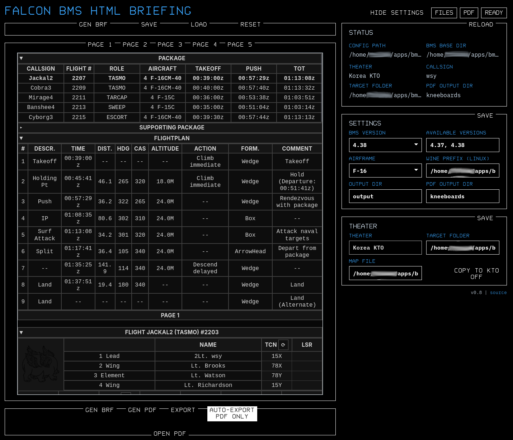
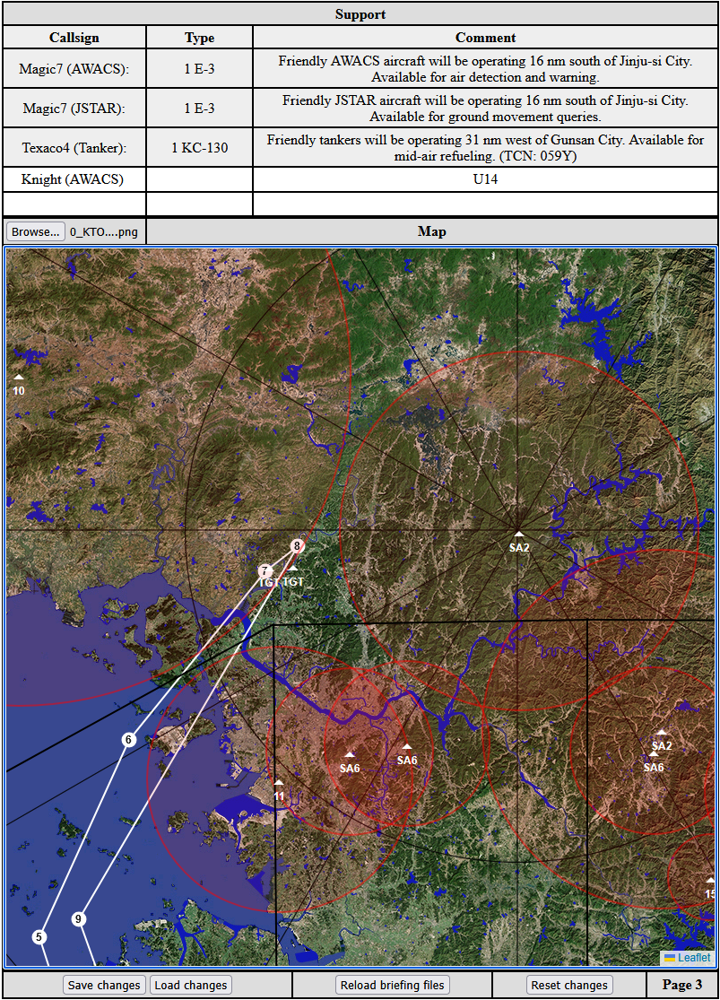
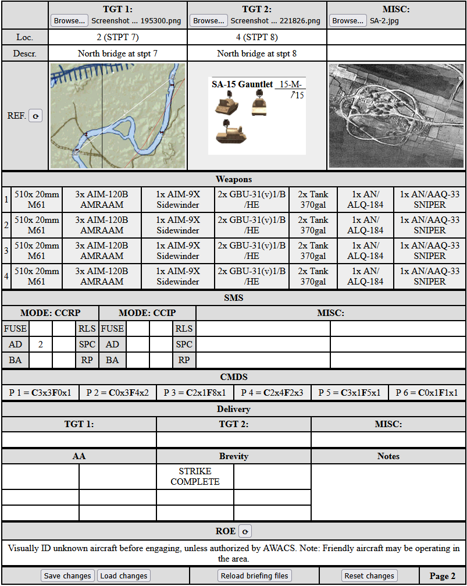

# Falcon BMS HTML Briefings
This is a collection of Python scripts to generate editable HTML kneeboard files for use with Falcon BMS. Currently it only parses data from briefing.txt and callsign.ini.

This is heavily inspired by other wonderful BMS kneeboard tools, such as [bms-kneeboard-server](https://github.com/AviiNL/bms-kneeboard-server) and [EZBoards](https://forum.falcon-bms.com/topic/19901/ezboards-generate-kneeboards-flights-comms-stpts-weather-from-briefings)

The main difference is that I wanted a tool that has minimal dependencies, is cross-platform and allows to modify the briefing files after they are filled with the briefing.txt information. The default kneeboard setup is inspired by my practice during multiplayer flights in the style of [UOAF](https://uoaf.net/).

## Requirements: 
### Running the python script
To use the Python script you need [Python 3](https://www.python.org/downloads/) and jinja2 module for it. If you already have Python you probably know what to do, something like
```
pip install jinja2
```
should work, depending on your operating system.
### Alternative: using the provided executables
Release should contain Windows and Linux archives with packaged executables. These should have no dependencies.

## Usage
In the config.ini file (see the example provided!), set the location of your BMS folder, the desired output folder for the .thml files and your callsign. E.g.
```
bms_location = D:\Falcon BMS 4.38
callsign = wsy
```

Then run
```
python html_brief.py
```
or, if you are using the packaged executable, just run ```html_brief.exe``` (on Windows) or ```html_brief``` (on Linux) inside the folder with the config.ini file and templates directory.

This will generate .html files in the /output directory. You can open them in a browser and edit them to your heart's content. When finished, you can, for example, print them to .pdf and use with [OpenKneeboard](https://openkneeboard.com/).

If you set the option ```joined = True``` (default) it will generate a single .html file with all the pages in it. When you open it in a (modern) browser and print it to PDF, it should automatically separate pages correctly. This saves some time compared to printing each page separately.

If you set the option ```monitor = True``` (default) the program will stay active and watch for changes to briefing.txt or callsign.ini, and run automatically when they change. Saves a click.

When an .html kneeboard is opened in a browser, the buttons in the bottom of the page can be clicked. The ```Save changes``` and ```Load changes``` buttons will save/load the contents of the editable fields to/from the browser memory. The button ```Reload briefing files``` will reload the parsed fields while preserving what was edited. The button ```Reset changes``` will set all editable fields to their initial values. 

In the config.ini file you may also modify the page contents: it is a list of lines of the form "page = section1, section2, ...", a single list of keywords producing a page of the kneeboard. Keywords refer to various kneeboard sections and coincide with the names of files in the templates folder. 

If you put an image with the filename "logo.png" into the /assets directory, after the next launch it will appear as a logo in the flight roster section, because why not.

### Launch options
``` -m, --monitor```: equivalent to ```monitor = True``` in config.ini (overrides config.ini value)
``` -s, --separated```: equivalent to ```joined = False``` in config.ini (overrides config.ini value)

## TLDR, suggested workflow
0. Set BMS location, callsign in config.ini, "joined = True" and "monitor = True" (defaults).
1. Launch the executable or python script.
2. "Print" briefing in BMS 2D and save the DTC.
3. Open the output/index_joined.html in the browser.
5. Modify it according to the IRL flight brief.
6. Save changes.
7. Print to PDF (the pages should be separated automatically), point the Openkneeboard to it if you use it.
8. Has something changed in the briefing or with target steerpoints? Press the ```Reload briefing files``` button. Go to 5.

Modification
-------------
The templates to generate kneeboards are in the "templates" folder. These are jinja2 templates written in simple HTML, so should be easy to modify.

Example output
-------------
<p float="left">



</p>
